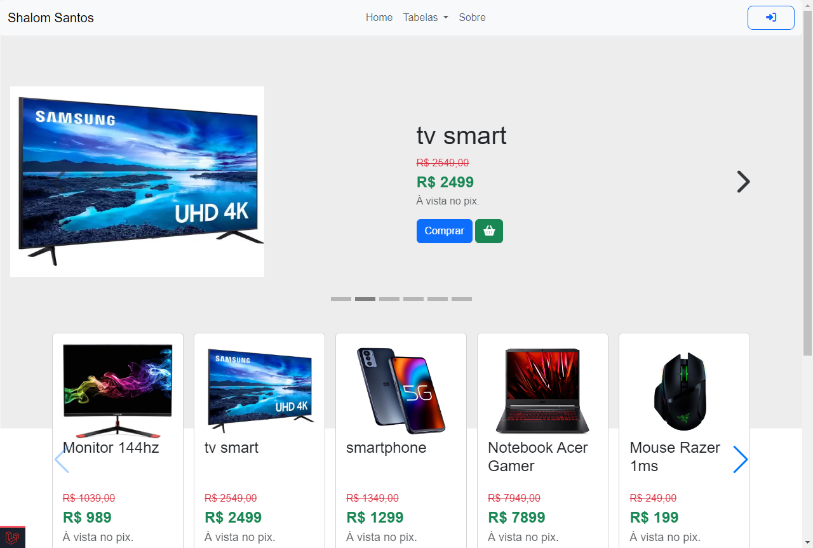

# Laravel 10, Docker, bootstrap

## Screenshots



## Passo a passo para rodar o projeto
Clone o projeto
```sh
git clone https://github.com/shalomsantos/dockerLaravel.git
```
```sh
cd dockerLaravel/
```


Crie o Arquivo .env
```sh
cp .env.example .env
```


Atualize essas variáveis de ambiente no arquivo .env
```dosini
APP_NAME="Especializa Ti"
APP_URL=http://localhost:8989

DB_CONNECTION=mysql
DB_HOST=mysql
DB_PORT=mysql
DB_DATABASE=mysql
DB_USERNAME=mysql
DB_PASSWORD=mysql

CACHE_DRIVER=redis
QUEUE_CONNECTION=redis
SESSION_DRIVER=redis

REDIS_HOST=redis
REDIS_PASSWORD=null
REDIS_PORT=6379
```


Suba os containers do projeto
```sh
docker-compose up -d
```


Acesse o container
```sh
docker-compose exec app bash
```


Instale as dependências do projeto
```sh
composer install
```


Gere a key do projeto Laravel
```sh
php artisan key:generate
```


Acesse o projeto
[http://localhost:8989](http://localhost:8989)
